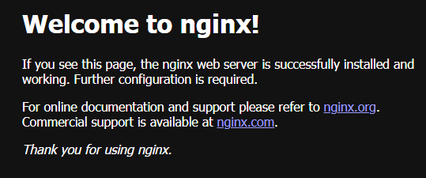

## Ansible Homework — установка и настройка Nginx через роль

Стенд поднимается с помощью **Vagrant + Hyper-V** и настраивается через **Ansible**.  
После выполнения playbook сервер **nginx доступен на порту 8080**.  
Конфигурация nginx развёртывается с использованием **Ansible роли**.

## Как запустить стенд

### 1. Установить зависимости

- Vagrant
- Hyper-V (Windows 11)
- Ansible (внутри ВМ)

### 2. Поместить файл `myubuntu.box` https://nc.kiselman.pro/index.php/s/BATCjSAb459KAkk в корень проекта
Проект уже содержит box-файл, который используется как базовый образ.

### 3. Поднять виртуальную машину
vagrant up --provider=hyperv

### 4. Подключиться к виртуальной машине
vagrant ssh nginx

### 5. Перейти в проект
cd ~/ansible-homework

### 6. Запуск плейбука
ansible-playbook -i hosts nginx.yml

## Результат
- nginx установлен
- конфигурация развернута из шаблона nginx.conf.j2
- сервис перезапущен
- доступ по http://172.22.226.192:8080
